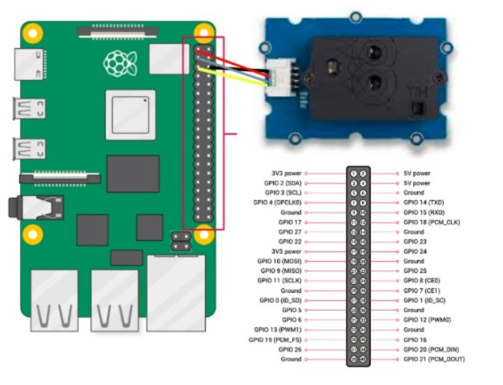
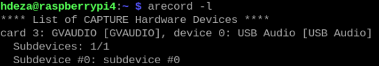
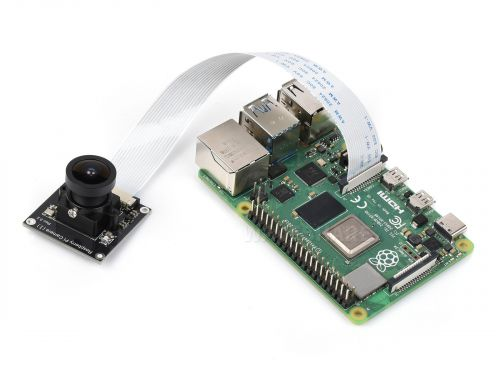

# DTHIS

 El dispositivo DTHIS nos ayuda a evaluar la calidad del ambiente dentro de salones de clases. EL DTHIS (Dispositivo de Temperatura, Humedad, Iluminación y Sonido) funciona con un microprocesador Raspberry Pi y 3 sensores/hardware diferentes, los cuales a través de una seria de códigos recolectan las variables de interes y las mandan a una plataforma de _IoT_ como Thingsboard.


## Piezas del DTHIS

| **Sensor**                                    | **Variable**                       | **Cantidad** |   **Link**                                                                                        |
|-----------------------------------------------|------------------------------------|--------------|---------------------------------------------------------------------------------------------------|
| SCD30 Sensirion                               | Temperatura, CO₂ y Humedad Relativa| 1            | (https://www.agelectronica.com/detalle.php?p=101020634*)                                          |
| Fisheye Camera                                | Luminancia                         | 1            | (https://www.agelectronica.com/detalle.php?p=SKU10344*)                                           |
| Micrófono ambiental USB                       | dB Maximos, minimos y promedio     | 1            | (https://www.steren.com.mx/microfono-usb-c-de-solapa-para-celular.html)                           | 
| Ventilador y disipador                        |                                    | 1            | (https://www.330ohms.com/products/ventilador-con-disipador-de-calor?_pos=3&_sid=9bcb8693a&_ss=r)  |
| Raspberry Pi 4 Model B                        | Microprocesador                    | 1            | (https://www.330ohms.com/collections/raspberry-pi-4/products/raspberry-pi-4-modelo-b-2gb)         |
| POE                                           |                                    | 1            | (https://www.agelectronica.com/detalle.php?p=RASPBERRYPI-POE%sumHAT)                              | 

## Elementos del repositorio
 
 - #### En [**CAD**](https://github.com/lata-mas/DTHIS_Jorge/tree/main/CAD) encuentra
	- Planos para 3D de la carcasa

 - #### En [**calibración**](https://github.com/lata-mas/DTHIS_Jorge/tree/main/calibración) encuentra
	- Manual de operación para recrear el DTHIS

 - #### En [**codigo**](https://github.com/lata-mas/DTHIS_Jorge/tree/main/codigo) encuentra
	- Códigos empleados en el SCD30, medición de niveles de ruido, mapas de luminancia

 - #### En [**diagramas**](https://github.com/lata-mas/DTHIS_Jorge/tree/main/diagramas) encuentra
	- Imagenes de los diagramas de conexión usados en la documentación

## Estructura del repositorio

 La estructura del repositorio está planeada para que solamente se descargue el archivo zip, y en tu propia maquina solamente darle el permiso a los scripts para que sean ejecutables pues dichos scripts ya están escritos

## Preparar la Raspberry 


  1. Instalar sistema operativo en la microSD [buscar un video YT y ligarlo]
  2. Crear un ambiente virtual  de Python llamado dthis en un folder venvs en el home [video]

Para preparar el ambiente virtual, debes instalar los paquetes de requirements.txt

1. Activa el entorno virtual:
```bash
source venvs/dthis/bin/activate
```
2. Instala las dependencias desde el archivo [requirements.txt](https://github.com/lata-mas/DTHIS_Jorge/blob/main/venvs/requirements.txt):
```bash
python -m pip install -r requirements.txt
```

- ## SCD30
 - ### 1. Habilitar comunicación
1. Se teclea lo siguiente en la terminal para entrar al menu de configuración
```bash
sudo raspi-config
```
2. Nos dirigimos al apartado `Interface Options`.
3. Habilitar **I2C**
4. Reinicias la _Raspi_

 - ### 2. Conexión del SCD30
Sigue el siguiente diagrama:


- ### 3. Script de Python
Ejecuta el script [scd30.py](https://github.com/lata-mas/DTHIS_Jorge/blob/main/codigo/SCD30.py). 

- ## Micrófono
  
### 1. Armado de circuito

En este caso usaremos un microfono USB-C al cual le pusimos un adaptador de C-USB. Antes de conectar el micrófono debes apagar la _Raspi_

### 2. Descargar paqueterias necesarias 
```
sudo apt update
sudo apt install alsa-utils
sudo apt install sox libsox-fmt-all
```
### 3. Comprobar micrófono
Para identificar a que puerto está conectado el micrófono, ejecuta el siguiente comando:
```bash
arecord -l
```
Se desplegará lo siguiente:



En este caso `card 3` es el puerto al que está conectado el micrófono, por lo tanto al ejecutar el comando para la captura de audio, se deberá definir `plughw:3,0`.

 ### 4. Grabar audio
Para grabar un audio se ejecuta el siguiente comando:
```bash
arecord -D plughw:3,0 -f cd -t wav -d 5 -r 44100 audio.wav
```
Esta instrucción graba 5 segundos, puedes comprobar que todo funciona escuchando el audio que acabas de grabar 

 ### 5. Concede los permisos necesarios a los scripts de audio 
Para que sea posible ejecutar los scripts a traves del crontab es necesario darle permiso con:
```bash
chmod +x script.sh
```
Funciones de cada uno de los scripts:

- [grabar.sh](https://github.com/lata-mas/DTHIS_Jorge/blob/main/codigo/grabar.sh): Graba 15 segundos de audio en calidad CD. 
- [dBmax.sh](https://github.com/lata-mas/DTHIS_Jorge/blob/main/codigo/dBmax.sh): Extrae la amplitud máxima del archivo de audio.
- [dBmin.sh](https://github.com/lata-mas/DTHIS_Jorge/blob/main/codigo/dBmin.sh): Extrae la amplitud mínima del archivo de audio.
- [rms.sh](https://github.com/lata-mas/DTHIS_Jorge/blob/main/codigo/rms.sh): Extrae la amplitud RMS, una medida de la potencia promedio del audio.
- [leer.py](https://github.com/lata-mas/DTHIS_Jorge/blob/main/codigo/leer.py): Lee los datos previamente extraidos y los mando a nuestra plataforma de _IoT_
- [ejecutable.e](https://github.com/lata-mas/DTHIS_Jorge/blob/main/codigo/ejecutable.e): Es el script que ejecuta los scripts en el orden adecuado


- ## Cámara
### 1. Conectar la cámara
- Apaga la Raspberry Pi.
- Conecta la cámara al puerto CSI.
- Asegúrate de que la cinta esté bien conectada, con la parte metálica hacia el conector del puerto.



### 2. Actualizar el sistema
```bash
sudo apt update && sudo apt upgrade
```

### 3. Reiniciar Raspberry Pi
```bash
sudo reboot
```

### 4. Tomar una foto
```bash
rpicam-still -o imagen.jpg
```

---

## Instalación de Radiance 

### 1. Instalar dependencias
```bash
sudo apt install csh make gcc g++ libx11-dev tcl tk
```

### 2. Descargar Radiance y soporte adicional
```bash
wget https://www.radiance-online.org/software/snapshots/radiance-HEAD.tgz
wget https://www.radiance-online.org/download-install/radiance-source-code/latest-release/rad5R4supp.tar.gz
```

### 3. Descargar `config.guess` y `config.sub`
```bash
wget -O config.guess 'http://git.savannah.gnu.org/gitweb/?p=config.git;a=blob_plain;f=config.guess;hb=HEAD'
wget -O config.sub 'http://git.savannah.gnu.org/gitweb/?p=config.git;a=blob_plain;f=config.sub;hb=HEAD'
```

### 4. Descomprimir archivos
```bash
tar -xvzf radiance-HEAD.tgz
tar -xvzf rad5R4supp.tar.gz
```

### 5. Copiar `config.sub` y `config.guess`
```bash
cp config.sub ray/src/px/tiff/
cp config.guess ray/src/px/tiff/
```

### 6. Compilar librería
```bash
cd ray/
sudo ./makeall library
```
- Cuando se pregunte **"Where do you want the library files [/usr/local/lib/ray]?"**, puedes presionar `Enter` para aceptar la ruta predeterminada. Luego, cuando te pregunte **"Install library files now [n]?"**, responde `y` (sí).

### 7. Configurar `RAYPATH`
Abre el archivo `.profile`:
```bash
nano ~/.profile
```
Agrega las siguientes líneas al final del archivo:
```bash
RAYPATH=.:/usr/local/lib/ray
export RAYPATH
```
Guarda y cierra el archivo presionando `Ctrl + O`, `Enter`, y luego `Ctrl + X`.

### 8. Compilar proyecto
Ejecuta el siguiente comando:
```bash
sudo ./makeall install
```
- Cuando te pregunte **"What is your preferred editor [vi]?"**, puedes simplemente presionar `Enter` para aceptar la opción predeterminada (vi)
- Cuando se te pregunte **"Where do you want the executables [/usr/local/bin]?"**, presiona `Enter` para aceptar la ruta predeterminada.
- Tras haber presionado `Enter` se mostrará la licencia de software de Radiance, presiona `q` para salir de la visualización y luego responde `y` (sí) para aceptar los términos. Selecciona `2` para Linux cuando se te pregunte por el tipo de sistema.
- Cuando se te pregunte **"Do you want to change it?"**, presiona `n` (no) para continuar con la configuración predeterminada.

### 9. Verificar instalación
Para asegurarte de que Radiance se haya instalado correctamente, ejecuta:
```bash
which rad
```
Esto debería devolver la ruta del ejecutable rad si la instalación fue exitosa.

## Configuración adicional

### 1. Instalar raw2hdr 
Descarga el software `raw2hdr` desde [aquí](http://www.anyhere.com/gward/pickup/raw2hdr.tgz) (debería descargarse si arrastras el enlace hacia otra pestaña). 
- Descomprime el archivo descargado con el siguiente comando, aunque igualmente puedes descomprimirlo sin la necesidad de acudir a la terminal:
  ```bash
  tar -xvzf raw2hdr.tgz
  ```
- Tras ello se creará la carpeta `raw2hdr` en tu **home** con los siguientes archivos ejecutables:
  - dcraw (Descartar)
  - exiftool (Descartar)
  - hdrgen (Descartar)
  - raw2hdr
- Para que raw2hdr funcione con imágenes DNG, accede al archivo ejecutable `raw2hdr` y agrega lo siguiente a la configuración del array `@exiftags` :
  ```bash
  -ISO -ApertureValue>FNumber -FNumber=2.6
  ```
- Finalmente para utilizar los comandos de los programas desde cualquier ubicación, los archivos ejecutables deben encontrarse en `/usr/local/bin/`:
  ```bash
  sudo cp exiftool raw2hdr /usr/local/bin/
  ```

### 2. Instalar programas necesarios  

#### hdrgen 
Puedes descargar *hdrgen* desde [aquí](http://anyhere.com/gward/pickup/hdrgen_AMDRaspian.tar.gz) (al arrastrar el enlace a otra pestaña se inicia la descarga).  
- Descomprime el archivo descargado preferentemente sin acudir a la terminal.
- Tras ello se creará la carpeta `hdrgen_AMDRaspian` en tu **home** con los siguientes archivos ejecutables:
  - hdrcvt
  - hdrgen
- Copia los archivos ejecutables hacia `/usr/local/bin/`:
  ```bash
  sudo cp hdrcvt hdrgen /usr/local/bin/
  ```

#### dcraw
Para instalar *dcraw*, asegúrate de ejecutar el comando:
```bash
sudo apt-get install dcraw
```

#### exiftool
Para descargar *exiftool*, ejecuta la siguiente línea:
```bash
wget https://exiftool.org/Image-ExifTool-12.97.tar.gz
```
- Una vez descargado, descomprime el archivo y accede al directorio:
  ```bash
  gzip -dc Image-ExifTool-12.97.tar.gz | tar -xf -
  cd Image-ExifTool-12.97
  ```
- Procede a instalarlo:
  ```bash
  perl Makefile.PL
  sudo make install
  ```

### 3. Instalar bibliotecas de fuentes
Finalmente, necesitas descargar una biblioteca de fuentes para poder visualizar las imágenes:
```bash
sudo apt-get install xfonts*
```
```bash
sudo apt-get purge xfonts-75dpi xfonts-100dpi
```
---

# Visualización de imágenes .hdr con Radiance
Para visualizar alguna imagen formato `.hdr` generada tras haber ejecutado el script [createHDR.sh](https://github.com/lata-mas/DTHIS_Jorge/blob/main/codigo/createHDR.sh), es necesario instalar la biblioteca `imagemagick`:
```bash
sudo apt-get install imagemagick
```
Ahora ejecuta el siguiente comando:
```bash
display /home/ruta/del/archivo/nombre.hdr
```
  
- ### Crontab
```bash
* * * * * /home/pi/DTHIS/codigo/ejecutable.e >> /home/pi/DTHIS/codigo/errores_e.log 2>&1
* * * * * /bin/bash -c 'source /home/pi/DTHIS/venvs/dthis/bin/activate && /home/pi/DTHIS/venvs/dthis/bin/python3 /home/pi/DTHIS/codigo/SCD30.py' >> /home/pi/DTHIS/codigo/SCD30.log 2>&1
*/2 * * * * /bin/bash -c 'source /home/pi/DTHIS/venvs/dthis/bin/activate && /home/pi/DTHIS/venvs/dthis/bin/python3 /home/pi/DTHIS/codigo/leer.py' >> /home/pi/DTHIS/codigo/errores_py.log 2>&1
*/30 * * * * /home/pi/DTHIS/codigo/createHDR.sh >> /home/pi/DTHIS/createHDR.log 2>&1
```

